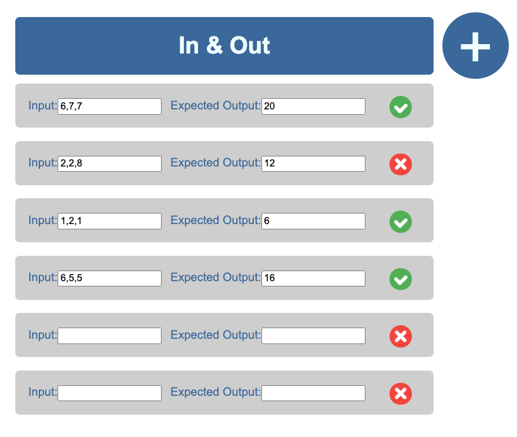

This project was bootstrapped with [Create React App](https://github.com/facebook/create-react-app).

[Visit the app](http://in-and-out.surge.sh/)

## What is in and out?

In and out in short is a web app to aid the TDD process. Test-driven development (TDD) is a development technique where you must first write a test that fails before you write new functional code. In & Out allows you to add test cases and keep track of which ones are passing as you progress through the TDD process.

